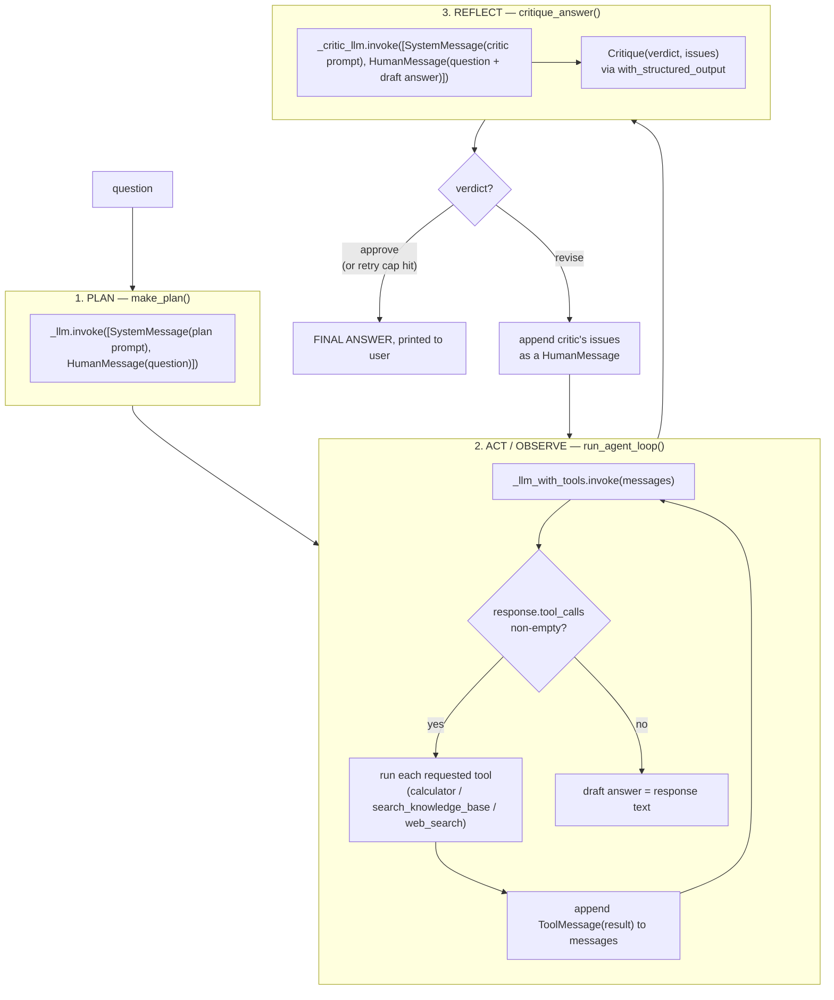

# Week 5 — LangChain Core: Rebuilding Week 4 on the Framework

Week 4's hand-rolled agent (plan → act/observe → reflect, no framework), rebuilt on top of [LangChain](https://python.langchain.com/)'s core building blocks — chat models, tool binding, structured output, message handling — to see directly how much boilerplate a framework actually removes, and what it costs to give up.

Same corpus, same underlying retriever (Week 3/4's hybrid vector+BM25+rerank pipeline), same four agentic patterns. Only the scaffolding changes.

This project also includes a second, independent agent — a GitHub repo summarizer (`repo_summarizer/`) — that applies the same tool-binding and structured-output skills to a live external API instead of local RAG. See "A second agent: GitHub repo summarizer" below.

## Core concepts, defined

LangChain terminology, in plain words, in the order you'd meet them reading `agent.py` top to bottom:

| Term | Plain-English definition | Where it appears here |
|---|---|---|
| **Chat model** | A wrapper around a provider's model (Claude, GPT, etc.) that gives every provider the same `.invoke(messages)` interface, so the rest of your code doesn't need to know which one it's talking to. | `ChatAnthropic(model=...)` |
| **Message** | One turn of a conversation, tagged with *who* said it, so the model can tell instructions from user questions from its own past replies. | `SystemMessage`, `HumanMessage`, `AIMessage`, `ToolMessage` — see the comment block above them in `agent.py` |
| **Tool** | A function the model can ask to have run on its behalf, described to it as a name + a plain-English description + a list of typed arguments. The model never runs it — it only ever *requests* it; your code decides whether to actually call it. | `calculator`, `search_knowledge_base`, `web_search` in `tools.py` |
| **`@tool` decorator** | Turns an ordinary Python function into a tool automatically, generating the argument schema from its type hints and the description from its docstring — instead of writing that schema out by hand. | `tools.py` |
| **Binding tools / `bind_tools()`** | Attaching a list of tools to a chat model so every future call tells the model "these are the tools you're allowed to request this turn." Returns a new object; it doesn't change the original model. | `_llm_with_tools = _llm.bind_tools(TOOLS)` |
| **Tool call** | The model's request to run a specific tool with specific arguments, found in `response.tool_calls` after invoking a tools-bound model. | Read inside `run_agent_loop()` |
| **Tool-calling loop** | The repeat-until-done cycle: ask the model something → if it requested a tool, run the tool and tell it the result → ask again → repeat until it answers directly instead of requesting another tool. | `run_agent_loop()` |
| **Structured output** | Instead of getting back free-form text you'd have to parse yourself, you describe the *shape* you want (a Pydantic class) and get back an object of exactly that shape, already validated. | `Critique` class + `.with_structured_output(Critique)` |
| **Runnable** | LangChain's umbrella term for "anything with a uniform `.invoke()` (and `.batch()`/`.stream()`) interface" — chat models, tool-bound models, structured-output wrappers, and (see "chain" below) combinations of these are all runnables. | `_llm`, `_llm_with_tools`, and `_critic_llm` are all runnables |
| **Chain** | A runnable built by piping other runnables together, most often with LangChain's `\|` operator (e.g. `prompt \| llm \| parser`), so a multi-step sequence becomes one callable unit. **Not used in this project** — see the comment above `_llm_with_tools` in `agent.py` for why the three model variables here are each used standalone instead of piped into one chain, and what using one would look like. |

## Workflow diagram



Same shape as Week 4's pipeline diagram — plan once, loop through act/observe until no more tools are requested, reflect, and either finish or feed the critique back in for one more act/observe round (capped at `MAX_REFLECTION_CYCLES = 2`). What differs is entirely *inside* the ACT box and the REFLECT box, per the comparison table below.

## What changed vs. Week 4

| | Week 4 (hand-rolled) | Week 5 (LangChain) |
|---|---|---|
| Chat model | Raw `anthropic.Anthropic().messages.create(...)` | `ChatAnthropic(model=...)` |
| Tool schemas | Hand-written `input_schema` JSON dicts per tool | `@tool`-decorated Python functions — schema auto-generated from type hints + docstring |
| Binding tools | Passed a raw `tools=[...]` list to every `.create()` call | `llm.bind_tools(TOOLS)` once, reused |
| Detecting a tool call | Manually check `response.stop_reason == "tool_use"`, scan `response.content` for `tool_use`-type blocks | `response.tool_calls` — a normalized list, already parsed |
| Structured output (critique) | Hand-written JSON schema dict + `output_config` + manual `json.loads(response.text)` | A `pydantic.BaseModel` + `llm.with_structured_output(Critique)` — returns a parsed, validated object directly |
| `web_search` | Anthropic's **server-side** tool (`{"type": "web_search_20260209", ...}`) — Claude's own infrastructure ran it | `DuckDuckGoSearchRun`, a plain **client-side** LangChain community tool — we call it, like the other two |
| Multi-block / server-tool handling | Had to distinguish `tool_use` vs. `server_tool_use`/`web_search_tool_result` blocks, handle `stop_reason == "pause_turn"`, recover from a `container_id` `BadRequestError` | None of this exists — every tool here is client-side, so there's nothing special to detect |

**Line count** (excluding blank lines and full-line comments, so pedagogical comments in either file don't skew the number): `agent.py` + `tools.py` combined —

- Week 4: **311** lines of actual logic
- Week 5: **216** lines of actual logic
- **~30% less code**, and the part that disappeared is exactly the trickiest part of Week 4 (see "Bugs we actually hit" in [Week 4's README](../Week_4_Handson/README.md)) — the server-side-tool detection, `pause_turn` handling, and the `container_id` recovery workaround. None of that is a LangChain-specific saving; it's what you get from moving `web_search` off Anthropic's proprietary server-side tool and onto a plain client-side one. `bind_tools` and `with_structured_output` account for the rest of the reduction — mainly removing hand-written JSON schemas and manual response parsing.

**Important nuance:** this isn't a clean "framework vs. no framework" comparison, because two things changed at once — the framework, *and* which kind of `web_search` tool is used. If Week 4 had also used a client-side web search tool, its line count would drop too. Framing this as "LangChain saves 30%" would overstate LangChain's own contribution; a good chunk of the saving is a tool-choice change that happened to be easy to make *because* LangChain's uniform tool interface doesn't distinguish server-side and client-side tools the way hand-rolling against the raw API forces you to.

## Project structure

```
Week_5_Handson/
├── agent.py          # plan / act-observe loop / reflect, rebuilt on LangChain
├── tools.py           # calculator + search_knowledge_base + web_search, as LangChain @tool objects
├── rag_tool.py         # Week 3/4's hybrid search + rerank, unchanged
├── ingest.py           # builds the Chroma vector store, unchanged from Week 4 (reads .md and .pdf)
├── chunking.py         # semantic chunker, unchanged from Week 3/4
├── corpus/             # the Nimbus sample docs, copied from Week 4
├── tests/
│   ├── test_tools.py    # calculator arithmetic + safety, adapted for LangChain's .invoke({...}) call shape
│   └── test_chunking.py # chunking correctness (same tests as Week 3/4)
├── repo_summarizer/     # a SECOND, independent agent -- see "A second agent" section below
│   ├── github_tools.py
│   ├── agent.py
│   └── tests/test_github_tools.py
├── requirements.txt
└── .env.example
```

## Tech reused from Week 3 and Week 4 vs. what's new this week

**Reused unchanged (copied file-for-file, not reimplemented):**

| From | File | What it does |
|---|---|---|
| Week 3 | `chunking.py` | Splits each document into sentence-respecting chunks (`semantic_chunk_text`) before embedding. |
| Week 3 | `rag_tool.py` | The actual retrieval pipeline: local embeddings (`all-MiniLM-L6-v2`) for vector search, `rank_bm25` for keyword search, Reciprocal Rank Fusion to merge the two ranked lists, then a cross-encoder reranker for the final top-3. This is the *real* RAG logic — Week 5 never touches how retrieval works, only how it's exposed to the agent. |
| Week 3 | `corpus/*.md` | The 5 sample Nimbus Cloud Storage policy documents. |
| Week 4 | `ingest.py` | Builds/rebuilds the Chroma vector store from the corpus (reads both `.md` and `.pdf`, a Week 4 addition). |
| Week 4 | The four agentic patterns themselves | Planning → acting/observing → reflecting → minimal multi-agent (worker + critic) — the *structure* of the agent is Week 4's design, only its implementation changed. |
| Week 4 | The system prompts' intent | `PLAN_SYSTEM_PROMPT`, `AGENT_SYSTEM_PROMPT`, `CRITIC_SYSTEM_PROMPT` say the same things Week 4's did (including the generalized "whatever documents are currently indexed" wording from the tool-scope bug fix), just reworded slightly for this agent's own tool descriptions. |

**New in Week 5 (the actual point of this week):**

| Package | What it's used for |
|---|---|
| `langchain` / `langchain-core` | The chat-model, message, and tool abstractions described in "Core concepts" above. |
| `langchain-anthropic` | `ChatAnthropic` — the LangChain-native wrapper around the same `anthropic` SDK Week 4 called directly. |
| `langchain-community` | Provides `DuckDuckGoSearchRun`, the replacement for Week 4's Anthropic-native `web_search` tool. |
| `ddgs` | The actual search library `DuckDuckGoSearchRun` calls under the hood (see "Bugs we actually hit" below for why this exact package name matters). |
| `pydantic` | Defines the `Critique` schema used for structured output — new to this project's *use* of it for a schema, though it was already a transitive dependency via `chromadb`/`anthropic` in Week 3/4. |

**Not reused, deliberately replaced:** Week 4's raw `anthropic.Anthropic().messages.create(...)` calls, its hand-written `input_schema` dicts, its manual `stop_reason`/content-block inspection, and its hand-rolled JSON-schema + `json.loads()` structured output — all replaced by the LangChain equivalents in the comparison table below.

## Setup

```bash
pip install -r requirements.txt
pip install -r requirements-dev.txt   # for pytest
cp .env.example .env                  # then add your real ANTHROPIC_API_KEY
python ingest.py                      # builds chroma_db/ from corpus/
```

## Running it

```bash
python agent.py
```

## Bugs we actually hit while building this

Two real issues, not just theoretical risks — same honesty policy as [Week 4's README](../Week_4_Handson/README.md#bugs-we-actually-hit-while-building-this-and-what-they-taught-us):

- **`langchain_community.tools.DuckDuckGoSearchRun` failed at import time with `ImportError: Could not import ddgs python package.`** The underlying `duckduckgo-search` PyPI package was renamed to `ddgs`, and `langchain-community`'s wrapper now expects the new name — but `requirements.txt` initially listed the old one. Installing `duckduckgo-search` succeeded with no warning; the failure only showed up later, at tool-construction time, and only when actually running the agent or its tests. Fixed by swapping `duckduckgo-search` for `ddgs` in `requirements.txt`. A reminder that "pip install succeeded" and "the package still provides what the code importing it expects" are two different guarantees, especially for community-maintained integration packages that wrap a separate library.
- **A stale API key produced a working-looking setup that failed only at the first real model call.** `.env` had a previously-valid `ANTHROPIC_API_KEY` copied over from Week 4 — everything up through `ingest.py` and the unit tests ran fine, since none of that touches the Anthropic API. The first actual `llm.invoke()` call failed with `401 authentication_error: API key is invalid`. Confirmed it wasn't a LangChain or code issue by reproducing the same 401 with the raw `anthropic` SDK directly, and confirmed it wasn't a bad copy by diffing the two `.env` files (identical). The key itself had simply stopped working — a good example of a failure mode that has nothing to do with the code and everything to do with an external credential, which is easy to misdiagnose as "something's wrong with the rebuild" if you don't isolate it first.

## The four agentic patterns, and where to find them

| Pattern | Where | What changed from Week 4 |
|---|---|---|
| **Planning** | `make_plan()` | Same idea — a separate, tool-free call sketches a short plan first. Now a plain `_llm.invoke([...])` with LangChain `SystemMessage`/`HumanMessage` objects instead of raw dicts. |
| **Tool use** | `run_agent_loop()` | The loop still runs until no more tools are requested, but it reads `response.tool_calls` (already parsed by LangChain) instead of inspecting `stop_reason` and raw content blocks by hand. |
| **Reflection** | `critique_answer()` + the retry loop in `answer_question()` | Same worker/critic split and same bounded retry (`MAX_REFLECTION_CYCLES = 2`), but the critic's verdict comes back as an already-validated `Critique` object via `with_structured_output`, not a hand-parsed JSON string. |
| **Multi-agent (minimal)** | The worker (`AGENT_SYSTEM_PROMPT`) + critic (`CRITIC_SYSTEM_PROMPT`) pair | Unchanged — still two distinct system prompts, two distinct jobs, and still the smallest possible version of this pattern, not real multi-agent orchestration. |

## The three tools

| Tool | Kind | What changed from Week 4 |
|---|---|---|
| `calculator` | client-side | Same AST-based safe evaluation, now a `@tool`-decorated function. Schema (the `expression: str` parameter) comes from the type hint instead of a hand-written `input_schema` dict. |
| `search_knowledge_base` | client-side | Wraps the exact same `rag_tool.py` function Week 3 built and Week 4 reused, unchanged — hybrid vector+BM25 search fused with RRF, then cross-encoder reranking. Only the tool *declaration* changed. |
| `web_search` | client-side (was **server-side** in Week 4) | `DuckDuckGoSearchRun` from `langchain_community.tools` — no API key needed, runs locally like the other two tools. This is the one deliberate scope change from Week 4, made specifically to test LangChain's tool-calling loop without also having to reproduce Anthropic's server-side tool mechanics inside it. |

## Things to be aware of

- **Extended thinking isn't enabled here.** Week 4 used `thinking={"type": "adaptive"}`; this rebuild leaves it off to keep `response.content` a plain string in the common case (see `_text()` in `agent.py`, which still defensively handles a list of content blocks — a callback to Week 4's "reading only the first text block" bug, worth guarding against even here). Not a checkpoint requirement for this week; a real difference worth knowing about if you compare answer quality side by side.
- **The `web_search` swap is a real behavior change, not just an implementation detail.** DuckDuckGo's results and Anthropic's own web search tool won't necessarily surface the same pages or the same quality of results — if you compare Week 4 and Week 5 answers to the same live-web question, a difference in the *answer* could come from this, not from the agent-loop rewrite.
- **No conversation memory across questions**, same limitation as Week 3 and Week 4 — every question starts a fresh `messages` list.
- **The planning step still isn't enforced** — same as Week 4, the plan is advisory context for the acting loop, not a constraint on it.
- **`langchain-community` prints a `DeprecationWarning` on import.** The package is being sunset in favor of standalone provider-specific integration packages (see the warning's own link for migration guidance). `DuckDuckGoSearchRun` still works today; this is a known future-maintenance note, not a current bug.

## Evaluation

Same position as Week 4: no formal precision/recall/Hit@k evaluation was built for this rebuild specifically. `rag_tool.py` is unchanged from Week 3/4, so Week 3's existing `eval/retrieval_eval.py` (Hit@k) and `eval/generation_eval.py` (LLM-as-judge) results still describe its retrieval quality. What's new here — the LangChain scaffolding itself — was checked by running it against the same handful of manual questions Week 4 used, comparing behavior and output, not by a labeled eval set. See [Week 4's README](../Week_4_Handson/README.md#evaluation--why-theres-no-precisionrecall-here) for the fuller reasoning on why that's the right amount of rigor for a project this size.

## A second agent: GitHub repo summarizer

A separate, contrasting exercise of the exact same two LangChain building blocks — `bind_tools()` and `with_structured_output()` — applied to a completely different tool surface: live calls to a real external API (GitHub's REST API) instead of a local RAG retriever, and no fixed corpus at all. Point it at any public `owner/repo`, and it decides for itself which tools it actually needs to explain that repo.

Deliberately simpler than the Nimbus agent: just the tool-calling loop and structured output — no separate planning call, no reflection/critique step. That's not a downgrade, it's a focused second look at the same core skills without re-deriving the fuller four-pattern architecture a second time.

### Project structure

```
repo_summarizer/
├── github_tools.py       # 5 @tool functions wrapping GitHub's REST API via `requests`
├── agent.py               # tool-calling loop + RepoSummary structured output (run with python -m)
├── report.py              # renders a RepoSummary as a self-contained HTML report card
├── reports/               # (gitignored) generated HTML reports, one per repo summarized
└── tests/
    ├── test_github_tools.py  # mocked unit tests, no network calls, no rate-limit risk
    └── test_report.py         # HTML rendering: content present, HTML-escaped, valid for all 3 health statuses
```

### Running it

```bash
python -m repo_summarizer.agent octocat/Hello-World
python -m repo_summarizer.agent psf/requests
```

Works against any public repo with no setup at all — GitHub's REST API allows unauthenticated read access, capped at 60 requests/hour. Optionally set `GITHUB_TOKEN` in `.env` (a plain personal access token, `public_repo` read scope is enough) to raise that to 5,000/hour if you're testing against several repos back-to-back.

Every run also writes an HTML report to `repo_summarizer/reports/<owner>_<repo>.html` (see "HTML report" below) — the terminal trace stays as-is (still the clearest way to watch which tools get called), the HTML is an additional, easier-to-read rendering of just the final `SUMMARY:` block.

### HTML report

Plain terminal text works but isn't the easiest way to actually read a summary, so `report.py` renders the same `RepoSummary` object as a small, self-contained HTML report card — no external fonts, scripts, or stylesheets, so the file opens correctly straight from disk, no server needed. Matches your system's light/dark theme automatically.

The card surfaces state as pills before detail (health, primary language, beginner-friendliness) — a repo's status should read at a glance, not require reading the summary paragraph first — then the purpose, a short list of the files most worth reading first, and the full summary underneath.

```bash
python -m repo_summarizer.agent MoonshotAI/Kimi-K3
# ... terminal trace ...
# HTML report written to repo_summarizer/reports/MoonshotAI_Kimi-K3.html
```

`repo_summarizer/reports/` is gitignored (generated output, not source) — every run overwrites that repo's report, same "always rebuilt fresh" philosophy as `ingest.py`'s vector store.

**A real bug this surfaced immediately:** the first live run (against `MoonshotAI/Kimi-K3`, a docs-only model-release repo) filled `main_language` with a full sentence — *"None (documentation only — Markdown/PDF, no source code)"* — instead of a short label, because nothing in the `RepoSummary` schema constrained its format. That's invisible in plain terminal text but immediately obvious as an overflowing, awkward pill once rendered visually — the HTML report caught a real prompt/schema weakness that plain-text output had been silently absorbing all along. Fixed by adding a `Field(description=...)` telling the model explicitly: short label only, put nuance in `summary` instead. Confirmed fixed by re-running against the same repo.

### The five tools

| Tool | What it does |
|---|---|
| `get_repo_metadata` | Description, primary language, license, stars/forks, open issue count, last-pushed date. |
| `get_readme` | Fetches and decodes the repo's README (base64-decoded from GitHub's API response), truncated if very long. |
| `get_repo_structure` | Lists files/folders at a given path, one level at a time — deliberately *not* a full recursive tree, so the model has to explore deliberately (a repo like `torvalds/linux` would return thousands of entries in one shot otherwise) rather than being handed a wall of irrelevant paths. |
| `get_file_contents` | Fetches one specific file, e.g. a dependency manifest (`package.json`, `requirements.txt`, `pyproject.toml`) once `get_repo_structure` has pointed at it. |
| `get_commit_history` | Recent commits (message, author, date), to gauge how actively the repo is maintained. |

### Structured output: `RepoSummary`

```python
class RepoSummary(BaseModel):
    name: str
    purpose: str
    main_language: str  # constrained via Field(description=...) to a short label, not a sentence -- see "HTML report" below for why
    key_files: list[str]
    health: Literal["active", "stale", "unmaintained"]
    beginner_friendly: bool
    summary: str
```

Same `with_structured_output()` pattern as the Nimbus agent's `Critique` class — the final answer is guaranteed to match this shape, not free text to parse by hand.

### Real example runs (not hypothetical)

Ran against two very different real repos to check the model genuinely *chooses* tools rather than following one fixed sequence:

- **`octocat/Hello-World`** (GitHub's canonical demo repo — high stars/forks purely from people practicing Git, essentially no content): called `get_repo_metadata` → `get_readme` → `get_repo_structure`, then correctly reasoned in its summary that the ~3,700 stars and ~6,750 open issues don't indicate a real, active software project — they're artifacts of it being a teaching fixture, not a signal of genuine health.
- **`psf/requests`** (a large, mature, real Python library): called `get_repo_metadata` → `get_readme` → **`get_commit_history`** — and *skipped* `get_repo_structure`/`get_file_contents` entirely, because the README already made the tech stack and purpose obvious. It also correctly noticed that recent commits were mostly automated Dependabot dependency bumps rather than feature work, and reasoned that this is normal for "a mature, stable library" rather than a sign of neglect.

Two different repos produced two genuinely different tool-call sequences — real evidence of the model choosing tools based on what it finds, not a hardcoded script.

### Comparison with the Nimbus agent

| | Nimbus agent (`agent.py`) | Repo summarizer (`repo_summarizer/agent.py`) |
|---|---|---|
| Tool surface | Local: calculator, a RAG retriever over a fixed 5-doc corpus, DuckDuckGo web search | External: 5 live GitHub REST API calls, no local data at all |
| Patterns demonstrated | All four: plan, act/observe, reflect, minimal multi-agent | Two: tool-calling loop, structured output |
| Knowledge base | Fixed, pre-ingested (`chroma_db/`) | None — freshly fetched per run, different every time the target repo changes |
| Structured output used for | A critic's approve/revise verdict | The final summary itself |
| Reused from Week 3/4 | Yes — `chunking.py`, `rag_tool.py`, `corpus/*.md`, `ingest.py` | No — entirely new tools and a fresh domain |

### Tests

```bash
python -m pytest repo_summarizer/tests/ -q
```

All 5 tools are tested with mocked `requests.get` responses (via `unittest.mock.patch`) — realistic success cases, 404s, an empty directory, a truncated long README, and the "wrong endpoint shape" cases (asking for a file that's actually a directory or vice versa). Deliberately not live-network tests: mocking keeps them instant, deterministic, and free of any rate-limit risk, at the cost of not verifying GitHub's API still behaves the way these tests assume — the two real end-to-end runs above are what actually confirm that.

### A bug we actually hit while testing this

Ran this agent against its own repository (`SujinJK/Week_5_Handson`) as a test, and it crashed:

```
UnicodeEncodeError: 'charmap' codec can't encode character '→' in position 103
```

Same root cause as Week 4's "Windows console encoding crash" bug (see [Week 4's README](../Week_4_Handson/README.md#bugs-we-actually-hit-while-building-this-and-what-they-taught-us)) and even Week 5's own `agent.py` — but `repo_summarizer/agent.py` is a separate file, hand-written fresh, and the fix wasn't carried over into it. This project's *own* README contains `→` arrows (e.g. "plan → act/observe → reflect"), so `get_readme` fetched a string containing U+2192, and printing that tool-result preview crashed the whole run on Windows' default `cp1252` console codepage — the exact same failure mode, just triggered by a genuinely new source of Unicode text (a live-fetched README) that the original fix was never tested against. Fixed the same way as before: force `sys.stdout` to UTF-8 at startup.

The honest lesson: copying a fix once doesn't mean copying it everywhere it's needed. A second, independent file doing similar I/O (printing arbitrary fetched text) needs the same defensive fix applied again, deliberately — it doesn't propagate on its own just because the same bug class was already solved once in this project.

### What's not done here, and why

- **No LangChain community `GitHubToolkit`.** It exists (`langchain_community.agent_toolkits.github`), but it's built around a GitHub App and a single fixed `GITHUB_REPOSITORY` env var — designed for managing one repo you own (creating issues, PRs), not for reading arbitrary public repos on the fly. Hand-rolling the 5 tools above was both a better fit and better practice for the actual tool-binding skill this week is about.
- **No handling for private repos.** `GITHUB_TOKEN` (if set) only helps with rate limits here — none of the tools pass any repo-specific auth, so a private repo you have access to would still 404 exactly like one you don't. Same-shape fix as the public case (pass the token through), just not built.
- **No comparison mode** (Level 4 from the original idea — summarizing two repos side by side). Would reuse everything here unchanged, just called twice and diffed; not built since it wasn't needed to demonstrate the core checkpoint skills.

## What's done vs. not done, and why

**Done:**
- All four agentic patterns rebuilt on LangChain: planning, tool-calling loop (`bind_tools` + `.tool_calls`), reflection (`with_structured_output`), minimal multi-agent (worker/critic)
- Real RAG retriever wired in as a tool (`search_knowledge_base`, unchanged from Week 3/4)
- Tests adapted for LangChain's tool-call interface, all passing
- A genuine, measured line-count comparison against Week 4, with the caveat that the `web_search` change (not just the framework) accounts for a real part of it
- A second, independent agent (`repo_summarizer/`) applying the same `bind_tools`/`with_structured_output` skills to a live external API instead of local RAG — verified against two real, very different public repos, showing genuinely different tool-call sequences per repo, not a fixed script

**Not done, and why:**
- **LangChain's own retriever abstraction (`VectorStore.as_retriever()` + `create_retriever_tool`) wasn't used.** `search_knowledge_base` is still the hand-rolled hybrid+rerank function from Week 3/4, just wrapped in `@tool`. Reason: that pipeline (BM25 fusion, cross-encoder reranking) is more sophisticated than LangChain's default similarity-search retriever, and re-implementing it in LangChain's abstractions wasn't the point of this week — the point was the *agent* loop, not re-deriving retrieval quality already validated in Week 3.
- **No AgentExecutor or LangGraph prebuilt agent (e.g. `create_react_agent`).** The tool-call loop in `run_agent_loop()` is still hand-written, just using LangChain's message/tool types — this was a deliberate choice to keep the plan→act→reflect structure visible and comparable to Week 4, rather than handing the whole loop to a prebuilt agent constructor. That's next week's territory (LangGraph), not this week's.
- **No formal evaluation harness**, for the same reasons as Week 4 — see "Evaluation" above.
